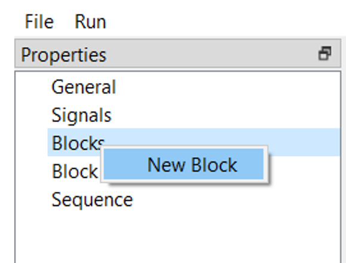
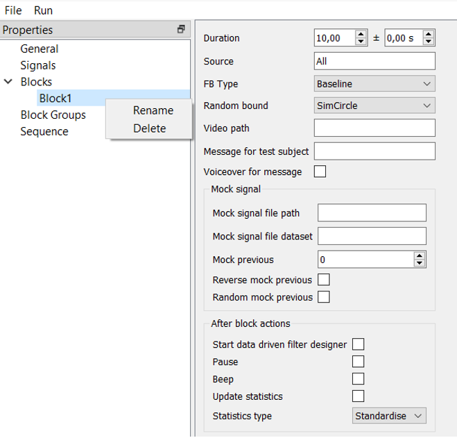

Blocks
======

When a signal is built, it is time to make experimental blocks, that is, what will be shown to the subject. To make one, click on the “Blocks” by the right button of the mouse and the “New Block” button.

   
With another click of the right button of the mouse on the created block, it is possible to rename or delete this block.

   
Let’s look at the settings inside a block.

General settings:
  **Duration**: The duration of the block consists of the basic duration (left field) plus random fluctuation between time (right). For example, to make every block with a different duration, we will type 30 +- 10, meaning every block will consist of 30 seconds plus or minus random value between 0 and 10.

  **Source**: could be set to “All” in the case when no specified signal is applied, for instance, during baseline. Otherwise, this field must contain the name of the derived signal, which has been given to the signal in the “Derived signal export” node.

  **FB type**: has two options – baseline (empty block or with a static message) or feedback, which type could be chosen in the “Random bound” field.

  **Video path**: (function is in testing) add a path to a video file to use it as a feedback.

  **Message for test subject**: here you can write a message which will be displayed to the subject during this block. For example, “Relax” or “Pause”.

  **Voiceover for message**: if your experiment includes a closed-eyes state, it could be useful to make an audio message for the subject. Just check it.

**Mock signal**:

For a mock condition, you have to give the subject some feedback unrelated to him or her, and these settings allow you to do this.

  **Mock signal file path**: choose a file with an EEG data from which a mock (fake) visualization will be generated. It will not be related to the actual data from EEG, and a subject will take the simulation.
  
  **Mock signal file dataset**: it is a number of the block. By default, it is “protocol1”, because after an experiment NFB Lab generates data, where blocks are organized as protocols with their numbers in sequence. If you use your data and do not want to use NFB Lab generated data, find out how blocks are organized in your recording.

  **Mock previous**: – if checked, it will take the previous block’s data and use it for the next feedback block.

  **Reverse and Random mock previous**: – if checked data from the previous block will be reversed and randomized, respectively.

**After block actions**:

  **Start data-driven filter designer**: after the block, if checked, there will be a filter designer where you can choose temporal and spatial filters including ICA, CSP, and SSD methods for the following processing and feedback generation.
  
  **Pause**: if checked, after a block’s finish, the pipeline will be stopped, and the next block could be started only after pressing the “play” button.
  
  **Beep**: after a block, there will be a short monotonous sound indicating the end of the block.

  **Update Statistics**: during a block, statistical approximations are collected, and this checkbox allows you to translate the signal in the next block from Volts to standardized values. The type of these values depends on the following option. 

  **Statistics Type**: with mean/std the signal will have a mean value of 0 and standard deviation of 1. Min/max generates values above zero (minimum) and usually below one (maximum). Notice that these characteristics will be active only after a block where “Update Statistics” was checked. 
