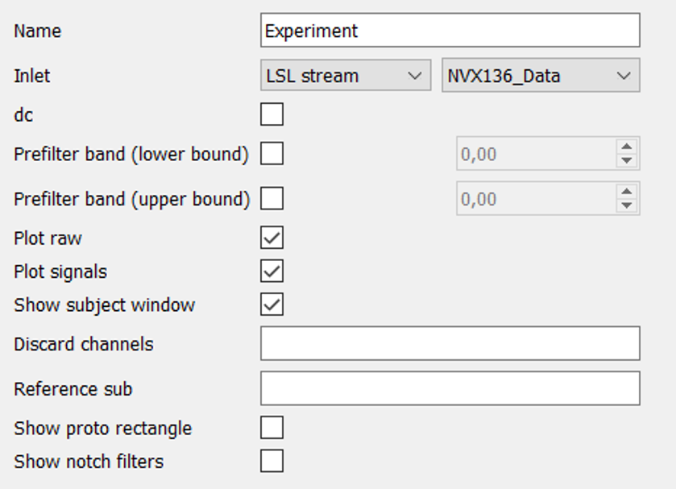

General
=======
In the “General” property (from the left column of the interface) after the opening of NFB Studio, you will see the following fields with default values. 

   
**Name**: the name of the experiment.

**Inlet**: The most important field here is “Inlet”. This field relates to the source of the data being processed. It could be data either from an LSL stream and generator in case of online experiments or from a h5 file for offline processing. In the latter case, you should type a full path to the file.

It is a brief description of the rest options:

**dc**: enabling DC-blocker. Notice, that DC-blocker applies to all raw data including EEG channels, photosensors, etc. 

**Prefilter band**: allow you to filter data before it will be filtered in the primary signal creation block. Notice: if you use both (lower and upper) bands, firstly you should type upper band to increase values in the lower one. Applies to all raw data.

**Plot raw**: whether there will be a window with the raw signals after starting the experiment.

**Plot signals**: creates the window displaying derived signals after processing.

**Show subject window**: enables the window with messages or feedback presentation for a subject.

**Discard channels**: here you could type channels that would be discarded from the overall processing and in the construction of spatial filters (for example: Cz P3). 

**Reference sub**: allow you to type channels which will be subtracted from others.

**Show photo rectangle**: during the experiment there will be the rectangle whose brightness depends on the derived signal amplitude and imitate the feedback stimulus. It is used for computation of the latency between obtaining the real electrical signal and time of feedback presentation, but a photosensor attached to the monitor is needed.

**Show notch filter**: additionally to raw data in the window after starting the experiment, it enables to see raw data with or without notch filter that cuts high-frequencies such as 50 and 60 Hz.
