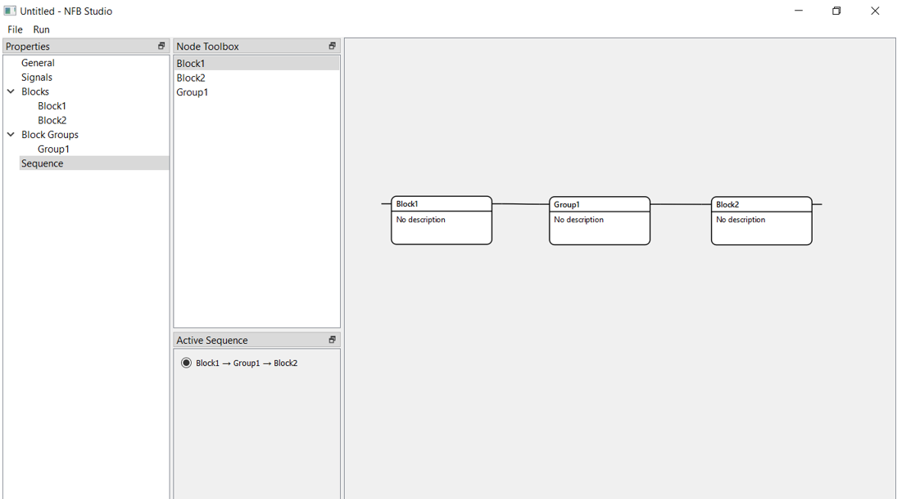

Sequence
========

The final step – sequence of blocks:

   
To manipulate nodes of blocks, follow the same logic as inside the “Signals” property – click and drag blocks from the toolbox and connect them in the space on the right side. It is important to connect nodes to activate all of them, otherwise, there will be only one activated block in the “Active Sequence” box.

If everything is finished, click “Run” at the top left part of the window or F9 to start an experiment.
