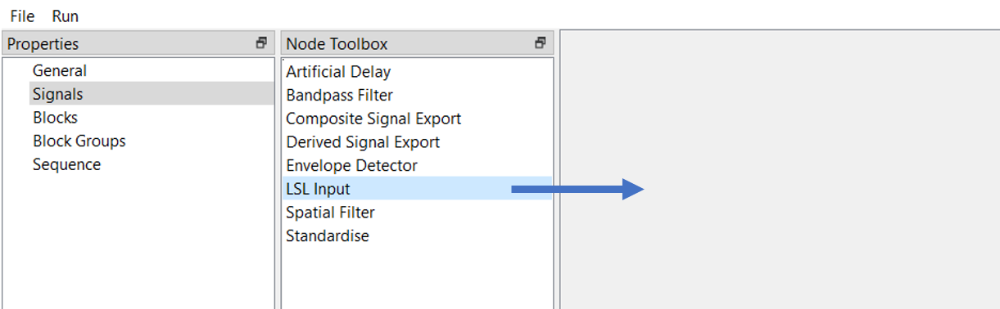
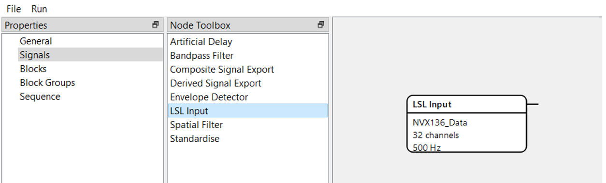
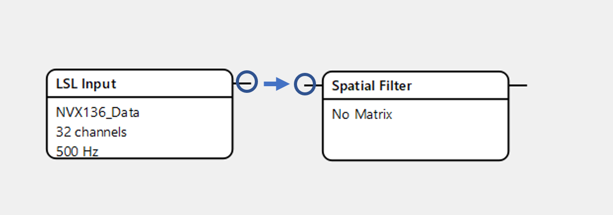
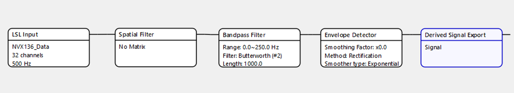
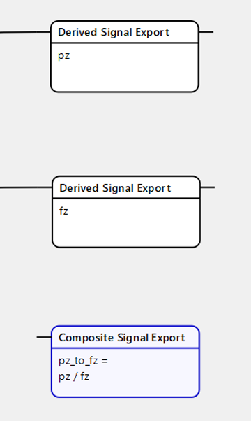

Signals
=======

The next step is making the signal. After clicking on the “Signals” property, choose a node from the “Node Toolbox” and drag it to space to the right.

The node will appear – it is a basic building block of the signal.

   
To connect two nodes, click on the small line at the first node and drag it to the same line at the second.

Below is the basic pipeline with output as an envelope and default settings.

It is also possible to build a signal without an envelope detector to make the filtered signal or even without a bandpass filter to get the raw signal.

Optionally, there are blocks of artificial delay and standardization (normalization) of the signal, which are placed after the Envelope detector.

Besides simple signals, composite ones are available. Create a “composite signal export” node, type the expression with simple signals’ names and connect these signals to composite one.

To open the settings (configuration) of the node, double click on it.

**Settings of nodes**:
  **LSL input**: there are immutable characteristics of the input like channel count (32) and sampling frequency (500 Hz), but you can name a data source (for example, NVX).
  
  **Spatial Filter**: here you should type a vector with channels that will be filtered and used in the signal. For example, P4=1, Cz=1. Also, it is possible to put a path to the txt file, where such a vector is presented.
  
  **Bandpass filter**: independent from the previous filtering inside the “General” property, here you can choose the range in which the signal will be filtered. For example, 8-12 Hz range corresponds to alpha rhythm, while 13-25 Hz – to beta rhythm. In the case of the Butterworth filter, you can type its order, which is usually chosen between 1-3. cFIR filter does not need order, but in both types of filter its length is needed, that is, how much of the data will be used to calculate the output.
  
  **Envelope detector**: in case you need to have a smooth envelope describing the filtered signal, you have to add an envelope detector. Several methods are available, including Rectification, Fourier and Hilbert Transform, and cFIR. The last method can be especially useful when fast online processing is required. The smoothing factor helps to make a more stable envelope without sharp bursts (usually, these factor equals 0.95 to smooth envelope). Exponential and Savitzky-Golay types of smoother are available.
  
  **Derived signal export**: one of the crucial parts of the signal, because all of the following processing will be dependent on the name of the signal created in this block.

  **Standardise**: with this block, the signal’s physical values will be standardized around arbitrary average and standard deviation, that is, average and std assigned in this block will be used to represent signal’s values after starting the experiment. 

  **Artificial Delay**: in case you need to investigate the effects of feedback presentation’s latency or use it in other ways, type required delay in ms and put this block before signal export.

  **Composite Signal Export**: allows you to combine many simple signals to create a composite one. Signal name will be used to attach this signal to feedback, while the “expression” field requires writing simple signals’ names and mathematical signs. For example, if I have two simple signals with names as P4 and Cz, I can write an expression like P4 + Cz or Cz/P4.

