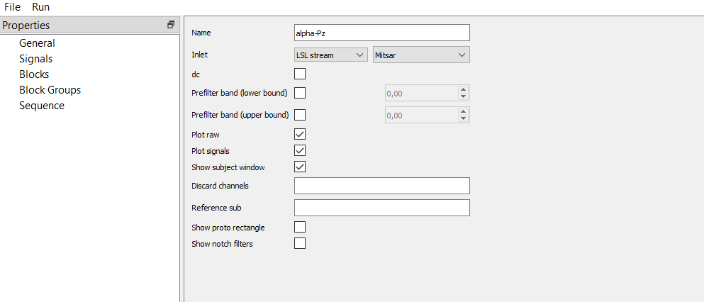
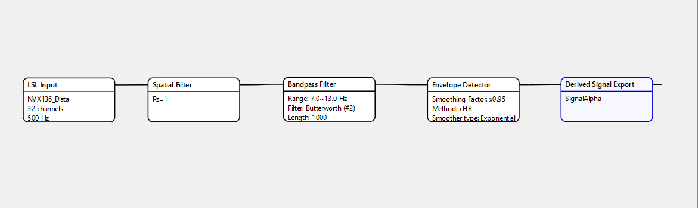
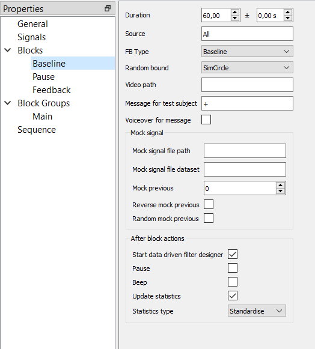
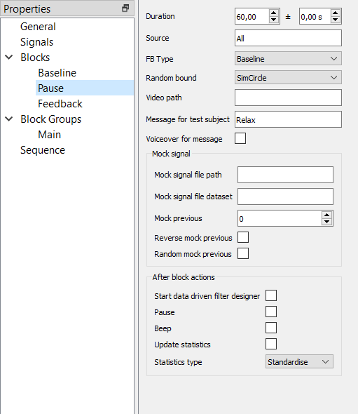
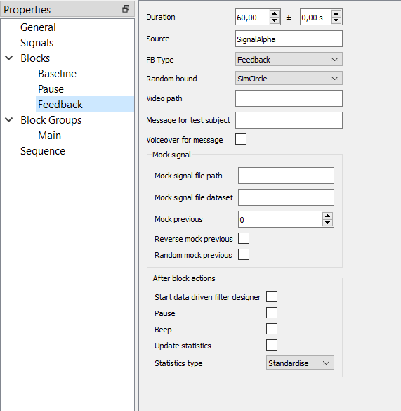
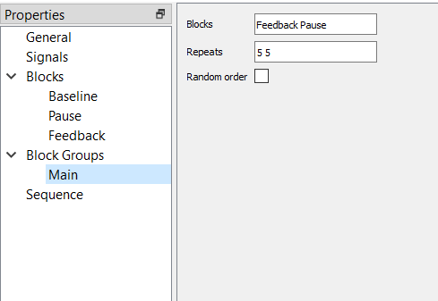
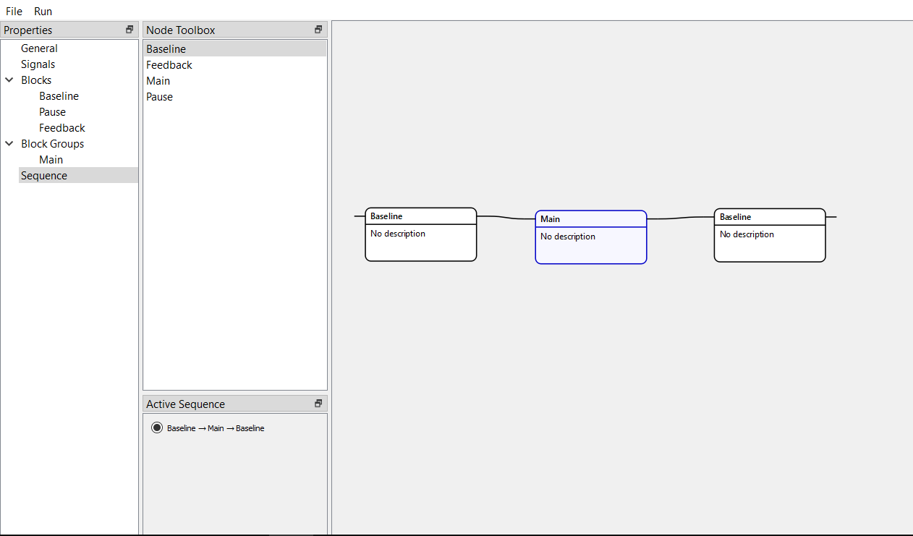
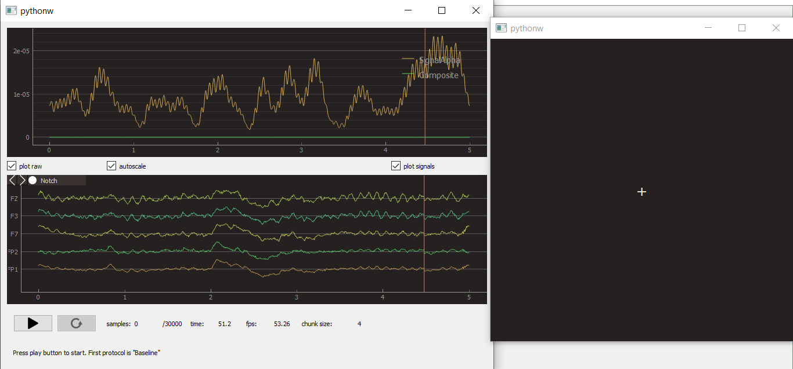

Example of the pipeline
=======================

Consider a parietal alpha rhythm training with 5 training sessions along with pauses, as well as baselines before and after the main part.
In the "General" property we give a name to the experiment and choose the "Mitsar" inlet since we want to use LSL-stream from another program. At the start of the experiment, there will be a window with signals and raw data, and a separated subject's window. 

Since the signal is parietal alpha rhythm, we choose Pz for a spatial filter and 7-13 Hz for a Butterworth filter with the second order and length of 1000 samples.

The resulted envelope should be fast-processed and smooth enough, so we choose a cFIR envelope detector and exponential smoothing with 0.95 factor.

Finally, we name derived signal to use this name in the block property.

We don't use artificial delay since we don't study the effects of latency of the neurofeedback.
   

   
The first block is a baseline. It has a constant duration (60 seconds) and does not procedure any particular signal ("All" source). To get the subject's attention, the message is "+" at the center of the screen. After the block, we want to start a data-driven filter designer where we can update temporal and spatial filters, remove components (using ICA), and so on. Also, we want to have standardized values of the signal.

   
After the feedback there will be pauses that last 60 seconds, don't use any signal, and have the "Relax" message.

   
The feedback block uses the "SignalAlpha" signal (that name was applied in the "Signal" property) and presents a circle whose edges (sharp/smooth) depend on the alpha envelope amplitude.

In the group we want to have feedback and pause blocks, each should be repeated 5 times.

   
Finally, we make a whole sequence of blocks and groups.

   
After starting the experiment, you will see raw and derived signals, along with the subject's window that could be resized to the full-screen size.
   

